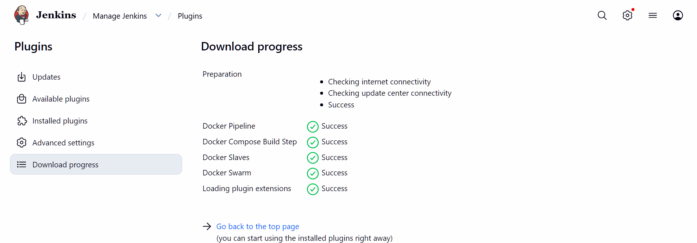
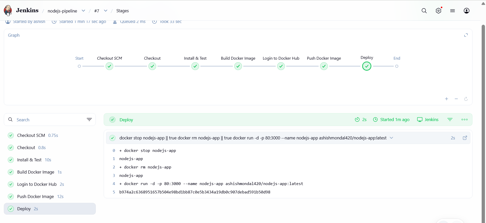
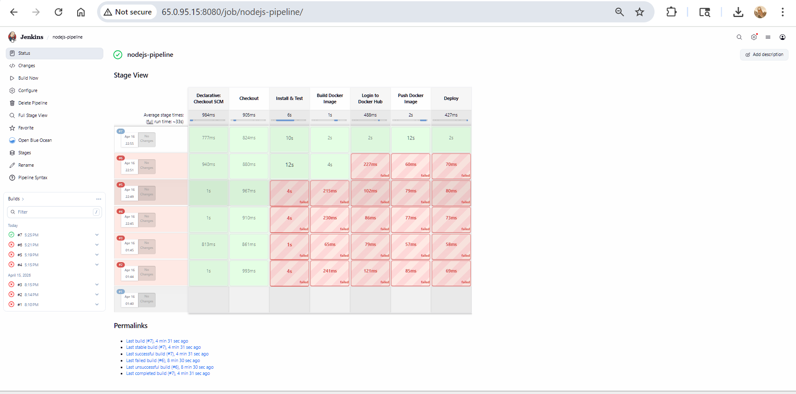
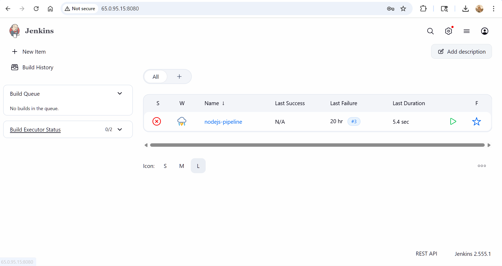

# 🚀 Project 2: Jenkins + Docker CI/CD Pipeline

## 📌 Overview

This project demonstrates a complete end-to-end CI/CD pipeline using Jenkins and Docker, deployed on AWS EC2.

The pipeline automates application build, testing, containerization, image push to DockerHub, and deployment.

---

## ⚙️ Architecture

```
GitHub → Jenkins → Docker Build → DockerHub → EC2 Deployment
```

---

## 🛠️ Tech Stack

* Jenkins (Docker container)
* Docker
* AWS EC2
* GitHub
* Node.js

---

## 🚀 Pipeline Stages

1. **Checkout Code** from GitHub
2. **Install Dependencies & Run Tests**
3. **Build Docker Image**
4. **Authenticate with DockerHub**
5. **Push Docker Image**
6. **Deploy Application on EC2**

---

## 🐳 Docker Image

👉 https://hub.docker.com/r/ashishmondal420/nodejs-app

---

## 🌐 Live Application

👉 http://65.0.95.15

---

## 📸 Screenshots

### Jenkins Pipeline Success



### Jenkins Console Output



### DockerHub Image



### Running Application on EC2



---

## 🧠 Key Learnings

* Jenkins pipeline creation using Docker agents
* Docker integration with CI/CD workflows
* Automated build and deployment pipeline
* Handling real-world DevOps issues and debugging
* Secure authentication with DockerHub

---

## ⚠️ Challenges Faced & Fixes

### 1. Docker not accessible inside Jenkins container

* **Issue:** `docker: not found`
* **Fix:** Installed Docker CLI inside Jenkins container and mounted Docker socket

---

### 2. Permission denied for Docker socket

* **Issue:** Permission error while accessing `/var/run/docker.sock`
* **Fix:**

  ```bash
  sudo chmod 666 /var/run/docker.sock
  ```

---

### 3. Jenkins Docker agent error

* **Issue:** `Invalid agent type "docker"`
* **Fix:** Installed **Docker Pipeline Plugin**

---

### 4. Missing DockerHub credentials

* **Issue:** Credentials not found in Jenkins
* **Fix:** Added credentials with ID `dockerhub-creds`

---

### 5. Git repository structure issues

* **Issue:** Nested repository and submodule confusion
* **Fix:** Restructured project and used proper branching strategy

---

### 6. Repeated Git authentication prompts

* **Issue:** Username/password required on every push
* **Fix:** Configured SSH-based authentication

---

## ✅ Final Outcome

✔ Fully automated CI/CD pipeline
✔ Dockerized deployment on EC2
✔ Real-world debugging experience
✔ Production-like DevOps workflow implementation

---
