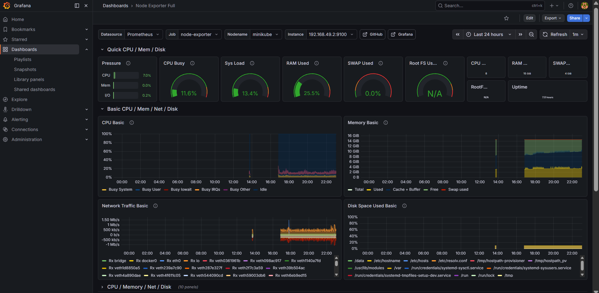
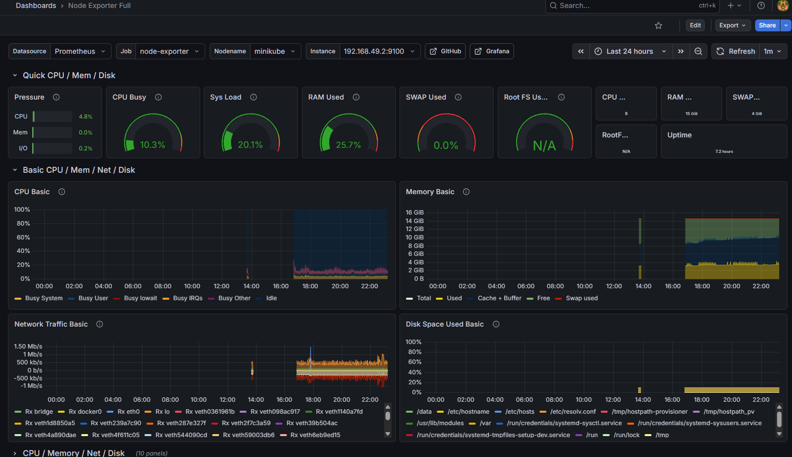
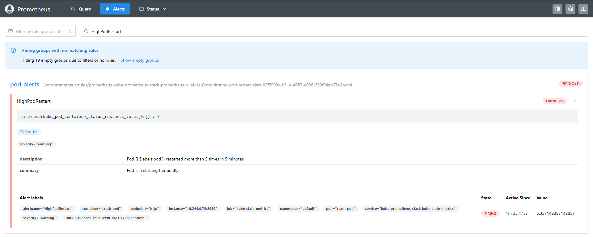

# 🚀 Project 26: Kubernetes Observability with Prometheus & Grafana

## 📌 Overview
This project demonstrates a complete **observability stack on Kubernetes** using:

- Prometheus (metrics collection)
- Grafana (visualization)
- AlertManager (alerting)
- kube-prometheus-stack (Helm)

The goal was to build **end-to-end monitoring + alerting** and validate it using a real failure scenario.

---

## 🛠 Tech Stack

- Kubernetes (Minikube)
- Helm
- Prometheus
- Grafana
- AlertManager
- kube-state-metrics
- Node Exporter

---

## 📂 Project Structure


project-26-prometheus-grafana-stack/
│── README.md
│── helm-values/
│── screenshots/
│ ├── grafana-dashboard.png
│ ├── node-exporter.png
│ ├── prometheus-targets.png
│ ├── alert-firing.png


---

## ⚙️ Setup Steps

### 1. Start Minikube
```bash
minikube start
2. Create namespace
kubectl create namespace monitoring
3. Add Helm repo
helm repo add prometheus-community https://prometheus-community.github.io/helm-charts
helm repo update
4. Install stack
helm install kube-prometheus-stack prometheus-community/kube-prometheus-stack -n monitoring
📊 Access Grafana
kubectl port-forward svc/kube-prometheus-stack-grafana 3001:80 -n monitoring

👉 Open: http://localhost:3001

Login:
Username: admin
Password:
kubectl get secret -n monitoring kube-prometheus-stack-grafana -o jsonpath="{.data.admin-password}" | base64 --decode
📈 Dashboards Used
Kubernetes Cluster Monitoring
Node Exporter Full
Kubernetes Pods Monitoring
## 📸 Screenshots

### 🔹 Grafana Dashboard


### 🔹 Node Exporter Metrics


### 🔹 Alert Firing 🚨

🚨 Custom Alert Rule
- alert: HighPodRestart
  expr: increase(kube_pod_container_status_restarts_total[5m]) > 5
  for: 1m
  labels:
    severity: warning
  annotations:
    summary: "Pod is restarting frequently"
    description: "Pod {{ $labels.pod }} restarted more than 5 times in 5 minutes"
🔥 Failure Simulation
kubectl run crash-pod --image=busybox --restart=Always -- /bin/sh -c "while true; do sleep 1; exit 1; done"
🚨 Alert Triggered
Condition met → restart count increased
Alert state transitioned:
Inactive → Pending → Firing
🧠 Key Learnings
Prometheus metrics collection and querying (PromQL)
Grafana dashboard visualization
Kubernetes observability architecture
Alert lifecycle management
Debugging metrics pipeline issues
✅ Outcome

✔ Full cluster observability
✔ Real-time monitoring dashboards
✔ Custom alerting system
✔ Real failure simulation and validation

🚀 Future Improvements
Slack / PagerDuty alert integration
Custom application monitoring
Recording rules optimization
