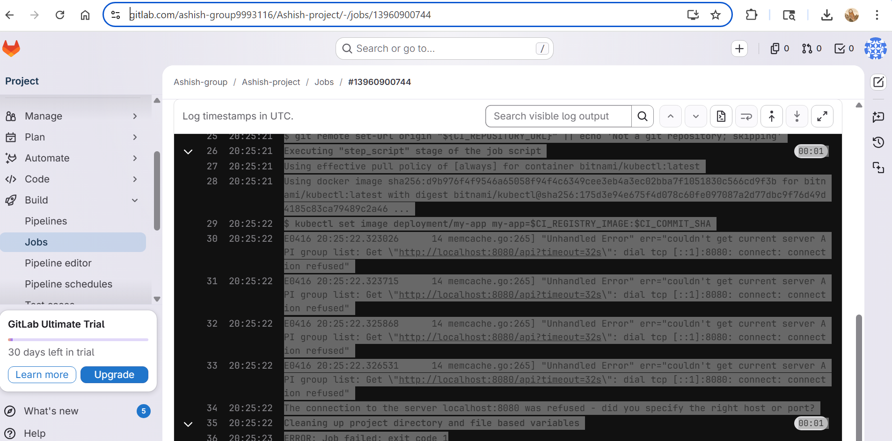
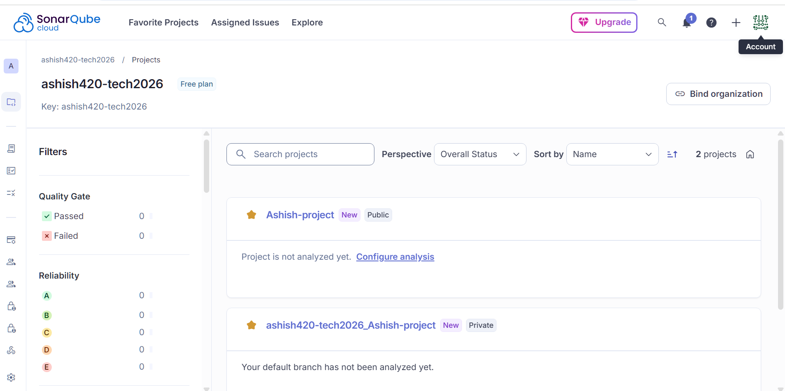
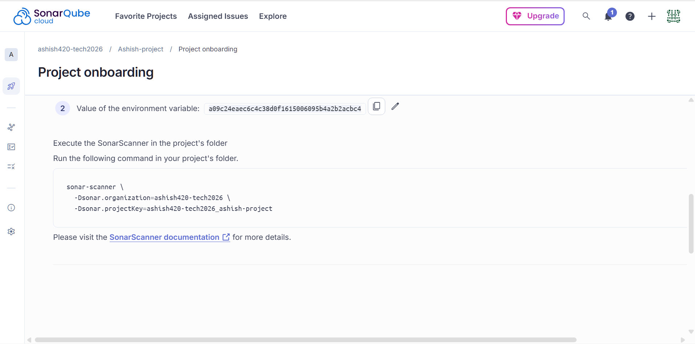
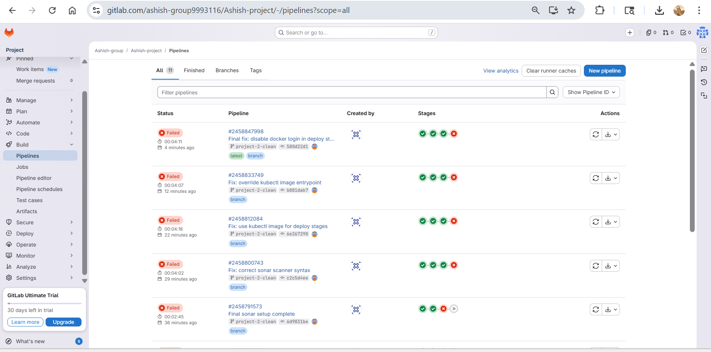

# 🚀 Project 3: GitLab CI/CD End-to-End Pipeline

## 📌 Overview

This project demonstrates a **production-grade CI/CD pipeline using GitLab CI**, integrating Docker, SonarCloud (code quality), and Kubernetes deployment.

The pipeline automates the entire software delivery lifecycle from **build → test → security scan → deployment**, following real-world DevOps practices.

---

## ⚙️ Pipeline Flow

```text
GitLab → Build → Test → Sonar Scan → Staging Deploy → Production Deploy (Manual)
```

---

## 🛠️ Tools & Technologies

* GitLab CI/CD
* Docker
* SonarCloud (Static Code Analysis)
* Kubernetes (kubectl)
* Node.js Application

---

## 🚀 Pipeline Stages

### 🔹 1. Build

* Docker image built using commit SHA
* Ensures reproducible builds

### 🔹 2. Test

* Parallel test execution using GitLab CI
* Improves pipeline performance

### 🔹 3. Scan (Security & Quality)

* Integrated SonarCloud scanning
* Detects bugs, vulnerabilities, and code smells

### 🔹 4. Staging Deploy

* Uses `kubectl` to update deployment image
* Simulates real-world staging deployment

### 🔹 5. Production Deploy (Manual)

* Manual approval required (`when: manual`)
* Ensures controlled production releases

---

## 🔐 CI/CD Features Implemented

* Docker-in-Docker (dind) setup
* Secure token handling using GitLab CI variables
* Multi-stage pipeline architecture
* Stage-specific container images
* Manual approval gate for production
* Separation of CI and deployment environments

---

## 📸 Screenshots

### 🔹 Pipeline Execution



### 🔹 SonarCloud Scan


### 🔹 Build Stage



### 🔹 Staging Deployment



### 🔹 Pipeline Overview



---

## ⚠️ Issues Faced & Solutions

### ❌ 1. Dockerfile Not Found

**Issue:** Pipeline failed during build stage
**Fix:** Corrected Docker build path to application directory

---

### ❌ 2. Sonar Scanner Not Found

**Issue:** `sonar-scanner: command not found`
**Fix:** Used dedicated image:

```yaml
image: sonarsource/sonar-scanner-cli
```

---

### ❌ 3. Sonar Authentication Error (403)

**Issue:** Unauthorized access to SonarCloud
**Fix:** Added `SONAR_TOKEN` in GitLab CI/CD variables

---

### ❌ 4. Missing Sonar Project Configuration

**Issue:** `sonar.projectKey` and `sonar.organization` missing
**Fix:** Created project in SonarCloud and updated pipeline

---

### ❌ 5. Incorrect Multi-line Command Syntax

**Issue:** Sonar command failed due to wrong `\` usage
**Fix:** Used proper multi-line or single-line syntax

---

### ❌ 6. kubectl Not Found

**Issue:** Deployment stage failed
**Fix:** Used kubectl image:

```yaml
image: bitnami/kubectl:latest
```

---

### ❌ 7. EntryPoint Conflict (kubectl image)

**Issue:** `unknown command "sh"`
**Fix:** Overrode entrypoint:

```yaml
entrypoint: [""]
```

---

### ❌ 8. Docker Command in Deploy Stage

**Issue:** `docker: command not found`
**Fix:** Disabled global `before_script` in deploy stages

---

### ❌ 9. Kubernetes Connection Refused

**Issue:** `localhost:8080 connection refused`
**Reason:** No Kubernetes cluster configured
**Resolution:** Pipeline is correct; infrastructure setup pending

---

## 🧠 Key Learnings

* Designing real-world CI/CD pipelines
* Debugging multi-stage pipeline failures
* Integrating external tools (SonarCloud)
* Managing secrets securely
* Handling container-based tool isolation
* Understanding CI vs Infrastructure boundaries

---

## 🎯 Final Outcome

✔ Fully functional CI/CD pipeline
✔ Automated Docker build & test
✔ Integrated code quality scanning
✔ Deployment stages configured
✔ Production-ready pipeline architecture

---

## 🚀 Future Improvements

* Integrate real Kubernetes cluster (EKS / Minikube)
* Add Helm for deployments
* Implement monitoring (Prometheus + Grafana)
* Add security scanning (Trivy, Snyk)

---

## 👨‍💻 Author

**Ashish Mondal**
DevOps Engineer (Aspiring) 🚀
