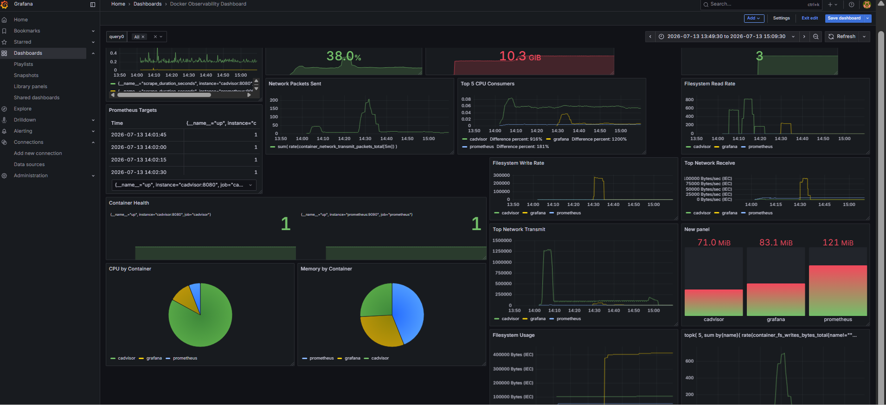
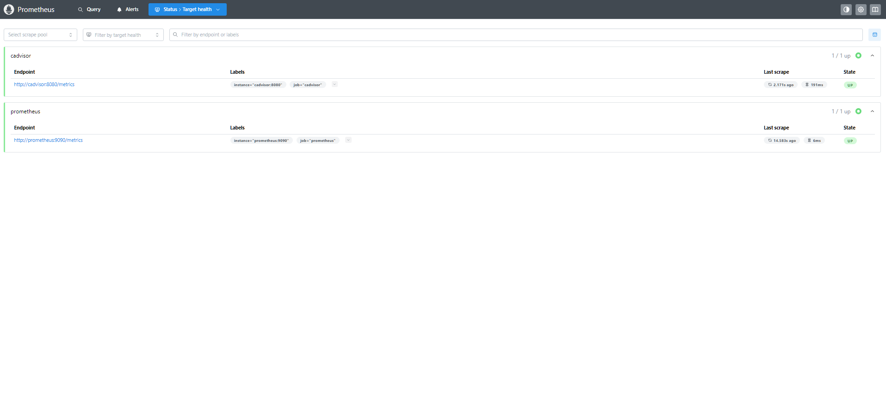
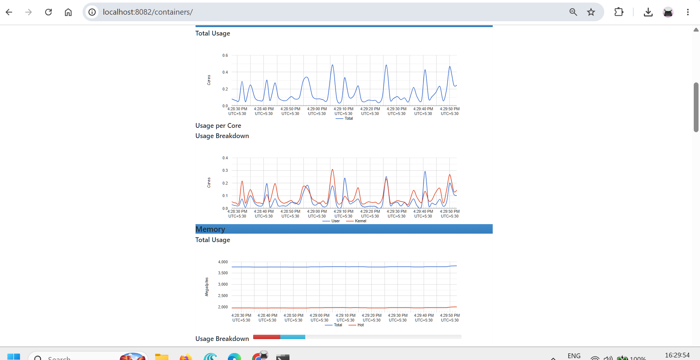
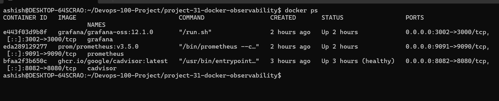

# 🚀 Project 31 - Docker Observability Dashboard


---

# 📌 Project Overview

This project demonstrates a complete **Docker Observability Stack** built using:

- Docker Compose
- cAdvisor
- Prometheus
- Grafana
- PromQL

The monitoring platform provides real-time visibility into Docker containers, including CPU, Memory, Filesystem, Network, and Container Health metrics.

---

# 🏗 Architecture

```
                +----------------------+
                |   Docker Containers  |
                +----------+-----------+
                           |
                           |
                     cAdvisor Metrics
                           |
                           v
                +----------------------+
                |      cAdvisor        |
                +----------+-----------+
                           |
                     Prometheus Scrape
                           |
                           v
                +----------------------+
                |     Prometheus       |
                +----------+-----------+
                           |
                     PromQL Queries
                           |
                           v
                +----------------------+
                |       Grafana        |
                +----------------------+
```

---

# 🛠 Tech Stack

- Docker
- Docker Compose
- cAdvisor
- Prometheus
- Grafana
- PromQL
- Linux (Ubuntu)

---

# 📂 Project Structure

```
project-31-docker-observability
│
├── docker-compose.yml
│
├── prometheus
│   └── prometheus.yml
│
├── grafana
│   ├── dashboards
│   └── provisioning
│
├── screenshots
│   ├── dashboard.png
│   ├── prometheus-targets.png
│   ├── cadvisor.png
│   ├── architecture.png
│   └── docker-ps.png
│
└── README.md
```

---

# 🚀 Services

| Service | Port |
|----------|------|
| Grafana | 3002 |
| Prometheus | 9091 |
| cAdvisor | 8082 |

---

# 🚀 Getting Started

Clone the repository

```bash
git clone https://github.com/Ashish420-tech/Devops-100-Project.git

cd project-31-docker-observability
```

Start monitoring stack

```bash
docker compose up -d
```

Verify containers

```bash
docker ps
```

Open

Grafana

```
http://localhost:3002
```

Prometheus

```
http://localhost:9091
```

cAdvisor

```
http://localhost:8082
```

---

# 📊 Dashboard Features

The Grafana dashboard includes:

- ✅ Running Containers
- ✅ Total CPU Usage
- ✅ Total Memory Usage
- ✅ CPU by Container
- ✅ Memory by Container
- ✅ Top CPU Consumers
- ✅ Top Network Receive
- ✅ Top Network Transmit
- ✅ Network Packets Sent
- ✅ Filesystem Usage
- ✅ Filesystem Read Rate
- ✅ Filesystem Write Rate
- ✅ Prometheus Targets
- ✅ Prometheus Scrape Duration
- ✅ Container Health
- ✅ Memory Usage by Container

---

# 📸 Screenshots

## Grafana Dashboard



---

## Prometheus Targets



---

## cAdvisor Dashboard



---

## Docker Containers



---

# 📈 PromQL Queries Used

### Running Containers

```promql
count(container_last_seen{name!=""})
```

---

### Total CPU Usage

```promql
sum(rate(container_cpu_usage_seconds_total[5m]))
```

---

### Total Memory Usage

```promql
sum(container_memory_usage_bytes)
```

---

### CPU by Container

```promql
sum by(name)(
rate(container_cpu_usage_seconds_total{name!=""}[5m])
)
```

---

### Memory by Container

```promql
sum by(name)(
container_memory_usage_bytes{name!=""}
)
```

---

### Top CPU Consumers

```promql
topk(
5,
sum by(name)(
rate(container_cpu_usage_seconds_total{name!=""}[5m])
)
)
```

---

### Top Network Receive

```promql
topk(
5,
sum by(name)(
rate(container_network_receive_bytes_total{name!=""}[5m])
)
)
```

---

### Top Network Transmit

```promql
topk(
5,
sum by(name)(
rate(container_network_transmit_bytes_total{name!=""}[5m])
)
)
```

---

### Filesystem Usage

```promql
topk(
5,
sum by(name)(
container_fs_usage_bytes{name!=""}
)
)
```

---

### Container Health

```promql
up
```

---

# 📊 Skills Demonstrated

- Docker Monitoring
- Prometheus Metrics Collection
- Grafana Dashboard Design
- PromQL
- Infrastructure Monitoring
- Container Performance Analysis
- Linux Monitoring
- Docker Compose
- Observability

---

# 🎯 Learning Outcomes

Through this project I learned:

- Deploying Prometheus with Docker Compose
- Monitoring Docker containers using cAdvisor
- Writing PromQL queries
- Building production-style Grafana dashboards
- Monitoring CPU, Memory, Filesystem and Network metrics
- Visualizing container health
- Creating enterprise observability dashboards

---

# 👨‍💻 Author

**Ashish Mondal**

DevOps & Cloud Engineer

GitHub:
https://github.com/Ashish420-tech

LinkedIn:
https://www.linkedin.com/in/ashish420/

---

# ⭐ If you found this project useful

Please consider giving the repository a ⭐.
